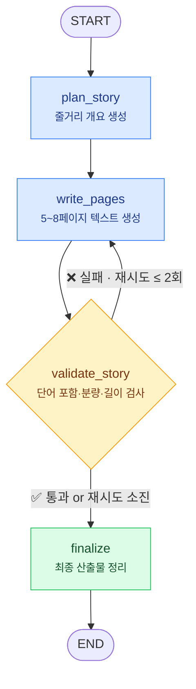

<div align="center">

# 🐰 WordiTale (워디테일)

**아이가 배울 단어로, 엄마 아빠 목소리로 읽어주는 우리 아이만의 동화책**

[](https://www.python.org/)
[](https://langchain-ai.github.io/langgraph/)
[](https://docs.claude.com/)
[]()

</div>

---

## 💡 컨셉

시중 동화책은 "우리 아이가 지금 배워야 할 단어"에 맞춰져 있지 않습니다.
WordiTale은 부모가 고른 **학습 단어 5~10개**를 자연스럽게 녹인 **5~8페이지 맞춤 동화**를 자동 생성하고,
**부모의 목소리를 학습한 TTS**로 아이에게 읽어주는 유아 교육 앱입니다.

| 목표 | 내용 |
|:---:|------|
| 📚 단어 학습 | 한 편당 5~10개의 학습 단어를 이야기 속에 자연스럽게 배치 |
| 🎙️ 부모 목소리 | 엄마/아빠 음성을 학습해 동화를 낭독 (음성 파이프라인, 추후 단계) |
| 📖 유아 맞춤 분량 | 5~8페이지, 페이지당 1~2문장의 간단한 텍스트 |

## 🤖 에이전트 설계

LLM은 "단어를 모두 넣어줘" 같은 제약을 종종 어깁니다.
그래서 **생성과 검증을 분리**하고, 검증 실패 시 **재작성 루프**로 품질을 보장합니다.



상세 설계(State 정의, 엣지 케이스 분석)는 📄 [docs/agent_design.md](docs/agent_design.md) 참고.

## 🗺️ 진행 단계

| 단계 | 내용 | 상태 |
|:---:|------|:---:|
| **Step 1** | 에이전트 설계 — 이름 · 목적 · 핵심 기능 · 그래프 구조 | ✅ 완료 |
| **Step 2** | LangGraph 기초 구축 — 커스텀 State · 노드 4개 · 조건부 엣지(재작성 루프) | ✅ 완료 |
| **Step 3** | 실제 Claude API 연동 및 생성 품질 테스트 | ⬜ 예정 |
| **Step 4** | 페이지별 삽화 프롬프트 생성 노드 추가 | ⬜ 예정 |
| **Step 5** | 부모 음성 TTS 스크립트 포맷 설계 및 음성 파이프라인 연동 | ⬜ 예정 |
| **Step 6** | 앱 UI 연동 (동화책 뷰어 + 낭독 재생) | ⬜ 예정 |

## 📁 폴더 구조

```
project_1/
├── README.md              # 프로젝트 소개 (이 문서)
├── requirements.txt       # 의존성
├── docs/
│   └── agent_design.md    # Step 1: 에이전트 설계 문서
└── src/
    └── worditale_agent.py # Step 2: LangGraph 에이전트
```

## 🚀 실행 방법

```bash
pip install -r requirements.txt
python src/worditale_agent.py
```

> `ANTHROPIC_API_KEY` 환경변수가 있으면 실제 Claude API로 생성하고,
> 없으면 **mock**(규칙 기반 더미) 로직으로 동작해 키 없이도 바로 실행됩니다.

**실행 예시** (mock 모드 — 검증 실패 → 재작성 루프 시연 포함):

```
=== WordiTale 실행 (LLM 모드: mock) ===

[줄거리] 아기 토끼 '토토'가 숲속 모험을 떠나요. ...

  p1. 아침 해가 뜨자 아기 토끼 토토가 폴짝 일어났어요.
  p2. 토토는 사과를 만나 활짝 웃었어요.
  ...
  p7. 토토는 달팽이를 만나 활짝 웃었어요. 토토는 엄마 품에서 새근새근 잠들었답니다.

[검증] 재작성 1회, 최종 상태: ok
```
