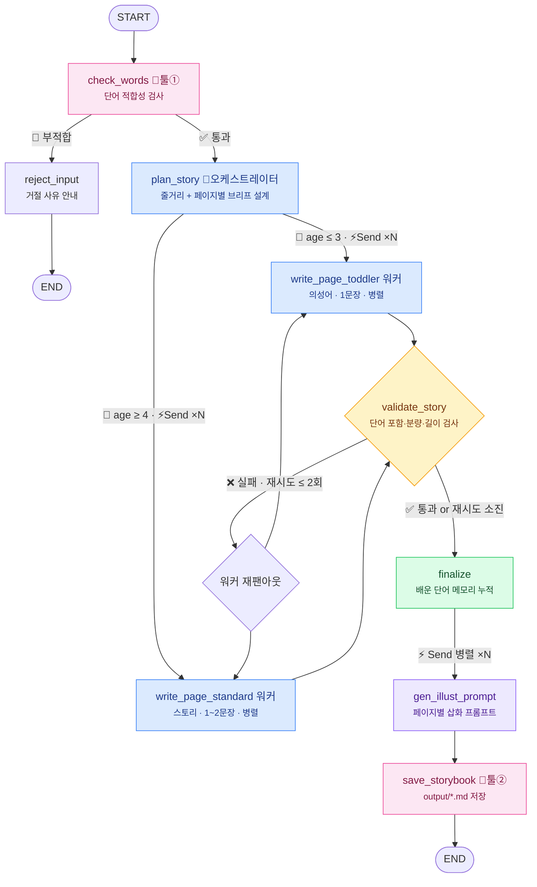

<div align="center">

# 🐰 WordiTale (워디테일)

**아이가 배울 단어로, 엄마 아빠 목소리로 읽어주는 우리 아이만의 동화책**

[](https://www.python.org/)
[](https://langchain-ai.github.io/langgraph/)
[](https://docs.claude.com/)
[]()

</div>

---

## 💡 컨셉

시중 동화책은 "우리 아이가 지금 배워야 할 단어"에 맞춰져 있지 않습니다.
WordiTale은 부모가 고른 **학습 단어 5~10개**를 자연스럽게 녹인 **5~8페이지 맞춤 동화**를 자동 생성하고,
**부모의 목소리를 학습한 TTS**로 아이에게 읽어주는 유아 교육 앱입니다.

| 목표 | 내용 |
|:---:|------|
| 📚 단어 학습 | 한 편당 5~10개의 학습 단어를 이야기 속에 자연스럽게 배치 |
| 🎙️ 부모 목소리 | 엄마/아빠 음성을 학습해 동화를 낭독 (음성 파이프라인, 추후 단계) |
| 📖 유아 맞춤 분량 | 5~8페이지, 페이지당 1~2문장의 간단한 텍스트 |

## 🤖 에이전트 설계

LLM은 "단어를 모두 넣어줘" 같은 제약을 종종 어깁니다.
그래서 **생성과 검증을 분리**하고, 검증 실패 시 **재작성 루프**로 품질을 보장합니다.



**아키텍처: 워크플로우 3패턴 조합** (Anthropic *Building Effective Agents* 기준)

| 패턴 | 구현 |
|------|------|
| 프롬프트 체이닝 | 기획 → 작성 → **검증(게이트)** → 마무리. 검증 실패 시 재작성 루프 |
| Orchestrator-Workers | `plan_story`(오케스트레이터)가 페이지 수·단어 배치·페이지별 장면(브리프)을 **동적으로 계획** → 페이지 워커들이 브리프대로 병렬 작성. 각 워커는 전체 줄거리 + 자기 브리프 + **앞뒤 페이지 장면 요약**을 받아 이음새가 어긋나지 않음 |
| 병렬 처리 (Send API) | 페이지 작성 워커 ×N + 삽화 프롬프트 생성 ×N 팬아웃 |

**과제 요건 매핑**

| 요건 | 구현 |
|------|------|
| 노드 3개 이상 | 9개 (check_words, reject_input, plan_story, write_page_toddler/standard, validate_story, finalize, gen_illust_prompt, save_storybook) |
| Conditional Edge (사용자 입력 분기) | 3개 — ① 단어 적합성 통과/거절, ② **나이(사용자 입력)에 따라 워커 종류 선택 + Send 팬아웃**, ③ 검증 재작성 루프(워커 재팬아웃) |
| Tool 연동 | 2개 — `check_words`(커스텀 검사 툴), `save_storybook`(파일 저장 툴) |
| 병렬 실행 (Send API) | 페이지 워커 ×N (plan_story 뒤) + `gen_illust_prompt` ×N (finalize 뒤) |
| 메모리 | `MemorySaver` + 아이별 `thread_id` — 배운 단어 누적, 다음 동화에 복습 단어로 재등장 |

상세 설계(State 정의, 엣지 케이스 분석, 비용 계획)는 📄 [docs/agent_design.md](docs/agent_design.md),
프로젝트 전체 현황·구조·주의사항은 📋 [docs/HANDOVER.md](docs/HANDOVER.md) 참고.

## 🗺️ 진행 단계

| 단계 | 내용 | 상태 |
|:---:|------|:---:|
| **Step 1** | 에이전트 설계 — 이름 · 목적 · 핵심 기능 · 그래프 구조 | ✅ 완료 |
| **Step 2** | LangGraph 기초 구축 — 커스텀 State · 노드 4개 · 조건부 엣지(재작성 루프) | ✅ 완료 |
| **Step 3** | 툴 2개 연동 · 사용자 입력(나이) 분기 · Send 병렬 삽화 프롬프트 · 메모리(배운 단어 누적) | ✅ 완료 |
| **Step 4** | 실제 API(OpenAI/Claude) 텍스트 생성 품질 테스트 | ⬜ 예정 |
| **Step 5** | 삽화 이미지 생성 연동 — 1차 Low 품질 테스트 → 최종 Medium 품질 출력 | ⬜ 예정 |
| **Step 6** | 부모 음성 TTS — 목소리 샘플 업로드(역할별 mp3 2개) ✅ → 클로닝·낭독 생성 ⬜ | 🟡 진행중 |
| **Step 7** | 앱 UI 연동 (동화책 뷰어 + 낭독 재생) | ⬜ 예정 |

## 📁 폴더 구조

```
project_1/
├── README.md              # 프로젝트 소개 (이 문서)
├── requirements.txt       # 의존성
├── requirements-dev.txt   # 개발용 의존성 (pytest)
├── app.py                 # Streamlit 대화형 UI (채팅 + 노드/툴 실행 시각화)
├── docs/
│   ├── agent_design.md    # 에이전트 설계 문서 (Step 1 + Step 3 확장)
│   └── HANDOVER.md        # 인수인계 문서 (현황·구조·실행법·주의사항)
├── src/
│   └── worditale/         # 에이전트 패키지
│       ├── config.py      #   비즈니스 규칙 상수 · 주인공 기본값
│       ├── state.py       #   그래프 State(TypedDict) + 리듀서
│       ├── llm.py         #   LLM 클라이언트 (OpenAI/Claude/mock 자동 선택)
│       ├── tools.py       #   툴① check_words · 툴② save_storybook
│       ├── nodes.py       #   노드 함수 (오케스트레이터/워커/검증/삽화/저장)
│       ├── graph.py       #   라우팅 + 그래프 조립 (+ 메모리 체크포인터)
│       ├── voice_store.py #   가족 목소리 mp3 샘플 저장소
│       └── __main__.py    #   CLI 데모
├── tests/                 # PyTest — 규칙·배선·폴백 검증 (mock 모드, 무료·결정적)
├── evals/                 # AI-as-judge — 실제 LLM 출력 품질 평가 (rubric 채점)
│   ├── cases.py           #   고정 평가 케이스 6종
│   ├── run_eval.py        #   평가 실행 + 리포트 생성
│   └── results/           #   평가 리포트 .md (자동 생성)
├── output/                # 생성된 동화책 .md (자동 생성, git 제외)
└── voices/                # 가족 목소리 녹음 (자동 생성, 개인정보 — git 제외)
```

## 🚀 실행 방법

### 대화형 앱 (Streamlit)

```bash
pip install -r requirements.txt
streamlit run app.py
```

채팅으로 **학습 단어 → 아이 나이 → 테마**를 차례로 입력하면 동화가 생성됩니다.

- 💡 상단 **이용 가이드**가 단어·나이·테마·주인공 입력 요령을 안내 (첫 방문 시 자동으로 펼쳐짐)
- 🛠️ 생성 중 **에이전트 노드·툴 실행 과정이 실시간 표시**되고, 완료 후엔 "실행 과정" 패널로 남습니다
- 🗺️ 상단 "에이전트 그래프 구조 보기"에서 전체 그래프를 mermaid로 시각화
- 👶 사이드바에서 **아이 이름별 메모리**(지금까지 배운 단어)를 확인 — 같은 이름이면 다음 동화에 복습 단어가 재등장
- 🐻 사이드바에서 **주인공 캐릭터** 변경 가능 — 본문·삽화 전체에서 같은 이름·같은 외형(캐릭터 시트)으로 유지
- 🎨 완성된 동화마다 페이지별 삽화 프롬프트 확인 가능
- 🎙️ **가족 목소리 등록** — 엄마·아빠·할아버지·할머니 역할별로 약 2분짜리 mp3 녹음 2개를 업로드 (길이·형식 자동 검증, `voices/`에 저장·git 제외) → 이후 음성 클로닝 TTS 낭독에 사용 예정

### CLI 데모

```bash
cd src && python -m worditale
```

> `OPENAI_API_KEY`가 있으면 OpenAI(gpt-4o-mini), `ANTHROPIC_API_KEY`가 있으면 Claude로 생성하고,
> 둘 다 없으면 **mock**(규칙 기반 더미) 로직으로 동작해 키 없이도 바로 실행됩니다.

**실행 예시** (mock 모드 — 데모 3종: 재작성 루프 / 나이 분기·메모리 / 입력 거절):

```
=== WordiTale 실행 (LLM 모드: mock) ===

--- 동화 1: 4세 · 숲속 모험 (재작성 루프 시연) ---
  p1. 아침 해가 뜨자 아기 토끼 토토가 폴짝 일어났어요.
  ...
[검증] 재작성 1회, 최종 상태: ok
[삽화 프롬프트] 7개 병렬 생성
[저장] ...\output\숲속 모험 이야기.md
[메모리] 지금까지 배운 단어: ['구름', '나비', '달팽이', '무지개', '바람', '사과']

--- 동화 2: 3세 · 바닷속 여행 (영아 스타일 + 복습 단어) ---
[줄거리] ... 지난번에 배운 구름, 나비도 반갑게 다시 만나요. ...
  p2. 물고기를 봐요. 폴짝폴짝!
  ...
[메모리] 지금까지 배운 단어: ['거북이', '구름', '나비', ... 11개 누적]

--- 동화 3: 부적합 단어 → 입력 거절 시연 ---
[상태] rejected
[사유] ["'칼'은(는) 유아 동화에 부적합한 단어입니다"]
```

## 🧪 테스트

두 층으로 나뉩니다 — **PyTest는 코드가 깨졌는지**, **AI-as-judge는 출력 품질이 좋은지**.

### PyTest (매 커밋 — 무료·빠름·결정적)

```bash
pip install -r requirements-dev.txt
pytest
```

API 키 없이 mock 모드로 실행됩니다 (테스트가 키를 자동 제거해 비용 발생 차단):

- `test_helpers.py` — 조사 선택·단어 배치·페이지 수 계산 등 순수 함수
- `test_state.py` — Send 병렬 결과 병합/누적 리듀서
- `test_tools.py` — check_words 규칙 필터, save_storybook 파일 저장
- `test_nodes.py` — 오케스트레이터 안전망(LLM이 규격 밖 출력을 줬을 때 폴백), 검증 게이트, 워커
- `test_graph.py` — 그래프 end-to-end: 거절 라우팅, 재작성 루프, 나이 분기, thread 메모리

### AI-as-judge 평가 (프롬프트 수정 시 수동 — API 비용 발생)

```bash
python evals/run_eval.py                  # 전체 6케이스
python evals/run_eval.py standard-4yo     # 특정 케이스만
```

고정 케이스(`evals/cases.py`)로 실제 동화를 생성한 뒤, judge LLM이 rubric
(서사 연결성 / 단어 자연스러움 / 문체 일관성 / 연령 적합성 / 캐릭터 지칭) 항목별 1~5점으로
채점하고 `evals/results/`에 리포트를 남깁니다. 항목 평균 4.0점 미만이면 ⚠️ 표시.

> 비결정적(같은 코드도 점수가 흔들림)이므로 CI 게이트가 아니라
> **프롬프트 개선 전후 비교용**으로 사용하세요.
